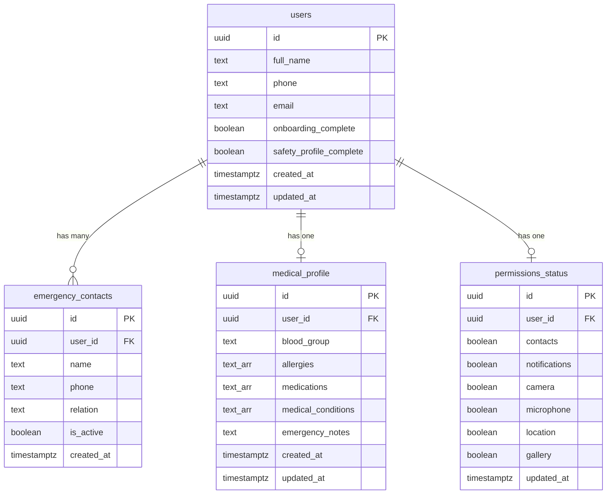

# Durga — Supabase Database Schema

> Living documentation of all Supabase tables, their purpose, and structure.  
> **Project**: Durga (`qfkmeqbtodaeqhaagryu`)  
> **Region**: `ap-southeast-1`  
> **URL**: `https://qfkmeqbtodaeqhaagryu.supabase.co`

---

## Authentication Strategy

**No Supabase Auth** — the app generates a **device-local UUID** stored in `SharedPreferences` and uses it as the primary key in the `users` table. All other tables reference this UUID via foreign keys. This means data is per-device (not per-account). Auth migration to Supabase Auth can happen later without schema changes — just swap the UUID source.

**RLS**: All tables have Row Level Security enabled. For now, policies use the `anon` key and filter by `user_id` passed from the client. When Supabase Auth is added, policies will switch to `auth.uid()`.

---

## Tables

### `users`

**Purpose**: Core user record created during onboarding. Stores basic identity and onboarding/safety profile completion flags.

| Column | Type | Default | Nullable | Notes |
|--------|------|---------|----------|-------|
| `id` | `uuid` | — | NO | **PK** — device-generated UUID |
| `full_name` | `text` | `''` | NO | From onboarding slide 2 |
| `phone` | `text` | `''` | NO | From onboarding slide 2 |
| `email` | `text` | `''` | NO | From onboarding slide 2 |
| `onboarding_complete` | `boolean` | `false` | NO | Set `true` after onboarding finishes |
| `safety_profile_complete` | `boolean` | `false` | NO | Set `true` after safety profile flow |
| `created_at` | `timestamptz` | `now()` | NO | |
| `updated_at` | `timestamptz` | `now()` | NO | |

---

### `emergency_contacts`

**Purpose**: Trusted contacts added during onboarding (slide 3) and via the "Manage" link on the homepage. Up to 3 active contacts shown as overlapping avatars on the homepage.

| Column | Type | Default | Nullable | Notes |
|--------|------|---------|----------|-------|
| `id` | `uuid` | `gen_random_uuid()` | NO | **PK** |
| `user_id` | `uuid` | — | NO | **FK → users.id** `ON DELETE CASCADE` |
| `name` | `text` | — | NO | Contact display name |
| `phone` | `text` | — | NO | Phone number |
| `relation` | `text` | — | YES | Parent / Partner / Friend / Sibling / Other |
| `is_active` | `boolean` | `true` | NO | Whether shown on homepage (max 3 active) |
| `created_at` | `timestamptz` | `now()` | NO | |

**Index**: `idx_emergency_contacts_user_id` on `user_id`

---

### `medical_profile`

**Purpose**: Health information collected during the safety profile completion flow. Used by emergency responders if the user triggers SOS.

| Column | Type | Default | Nullable | Notes |
|--------|------|---------|----------|-------|
| `id` | `uuid` | `gen_random_uuid()` | NO | **PK** |
| `user_id` | `uuid` | — | NO | **FK → users.id** `ON DELETE CASCADE`, **UNIQUE** |
| `blood_group` | `text` | — | YES | A+, A-, B+, B-, AB+, AB-, O+, O- |
| `allergies` | `text[]` | `'{}'` | NO | Array of allergy strings |
| `medications` | `text[]` | `'{}'` | NO | Array of current medication names |
| `medical_conditions` | `text[]` | `'{}'` | NO | Diabetes, Asthma, Heart Disease, etc. |
| `emergency_notes` | `text` | `''` | NO | Free-form additional notes |
| `created_at` | `timestamptz` | `now()` | NO | |
| `updated_at` | `timestamptz` | `now()` | NO | |

**Constraint**: `UNIQUE(user_id)` — one medical profile per user.

---

### `permissions_status`

**Purpose**: Tracks which device permissions the user has granted during the safety profile flow. Used to calculate the safety profile completion percentage.

| Column | Type | Default | Nullable | Notes |
|--------|------|---------|----------|-------|
| `id` | `uuid` | `gen_random_uuid()` | NO | **PK** |
| `user_id` | `uuid` | — | NO | **FK → users.id** `ON DELETE CASCADE`, **UNIQUE** |
| `contacts` | `boolean` | `false` | NO | `Permission.contacts` |
| `notifications` | `boolean` | `false` | NO | `Permission.notification` |
| `camera` | `boolean` | `false` | NO | `Permission.camera` |
| `microphone` | `boolean` | `false` | NO | `Permission.microphone` |
| `location` | `boolean` | `false` | NO | `Permission.location` |
| `gallery` | `boolean` | `false` | NO | `Permission.photos` |
| `updated_at` | `timestamptz` | `now()` | NO | |

**Constraint**: `UNIQUE(user_id)` — one permissions record per user.

---

## Future Tables (Not Yet Implemented)

> [!NOTE]
> These are planned for later iterations. Documenting them here for reference.

### Nearest Help (Google Places API)
Currently using **hardcoded sample data** for police stations and hospitals. When a Google Maps API key with Places enabled is available:
- Call Places API `nearbysearch` with `type=police` and `type=hospital`
- Cache results locally (no Supabase table needed — location data is transient)
- Display closest result for each category with name + distance
- Tapping opens Google Maps directions via `url_launcher`

**To implement**: Add API key to `AndroidManifest.xml` and `Info.plist`, create a `places_service.dart` that calls the Places HTTP API, and replace the hardcoded data in `new_home_screen.dart`.

### SOS Alerts (Supabase)
Currently SOS goes through the existing FastAPI backend. Future migration:
- `sos_alerts` table with `user_id`, `latitude`, `longitude`, `is_active`, `created_at`, `resolved_at`

### Journey Tracking (Supabase)
Currently through FastAPI. Future migration:
- `journeys` table with start/end coordinates, waypoints, active status

---

## Entity Relationship Diagram

